# DiagramWeave 模块依赖图

> 自动生成 - 基于全局命名空间引用分析

```mermaid
flowchart TD

    bootstrap["bootstrap\n[2 exports]"]
    canvas-tools["canvas-tools\n[1 exports]"]
    commands["commands\n[3 exports]"]
    content-pack["content-pack\n[1 exports]"]
    contracts["contracts\n[3 exports]"]
    extension-kernel["extension-kernel\n[2 exports]"]
    external-importers["external-importers\n[0 exports]"]
    field-mapping["field-mapping\n[1 exports]"]
    history["history\n[2 exports]"]
    i18n["i18n\n[1 exports]"]
    import-preview["import-preview\n[2 exports]"]
    node-colors["node-colors\n[2 exports]"]
    offline-viewer["offline-viewer\n[0 exports]"]
    process-analysis["process-analysis\n[0 exports]"]
    property-tools["property-tools\n[2 exports]"]
    result["result\n[1 exports]"]
    routing-rules["routing-rules\n[1 exports]"]
    shape-library["shape-library\n[2 exports]"]
    stencil-manager["stencil-manager\n[3 exports]"]
    svg-sanitizer["svg-sanitizer\n[1 exports]"]
    template-center["template-center\n[1 exports]"]
    utils["utils\n[1 exports]"]
    visio-bridge["visio-bridge\n[2 exports]"]
    visio-preview["visio-preview\n[2 exports]"]

    bootstrap --> content-pack
    bootstrap --> utils
    commands --> visio-bridge
    content-pack --> bootstrap
    content-pack --> svg-sanitizer
    contracts --> utils
    contracts --> visio-bridge
    extension-kernel --> import-preview
    extension-kernel --> visio-bridge
    extension-kernel --> visio-preview
    history --> utils
    import-preview --> visio-bridge
    node-colors --> utils
    property-tools --> utils
    result --> visio-bridge
    shape-library --> utils
    stencil-manager --> utils
    stencil-manager --> visio-bridge
```

## 模块详情

### bootstrap

- **文件**: `diagramweave-bootstrap.js`
- **导出命名空间**: `DiagramWeaveBootstrap`, `DiagramWeaveUtils.compareVersions`
- **依赖模块**: `DiagramWeaveBootstrap`, `DiagramWeaveContent`, `DiagramWeaveUtils`

### canvas-tools

- **文件**: `diagramweave-canvas-tools.js`
- **导出命名空间**: `DiagramWeaveCanvasTools`
- **依赖模块**: `DiagramWeaveCanvasTools`

### commands

- **文件**: `diagramweave-commands.js`
- **导出命名空间**: `DiagramWeave`, `DiagramWeave.commands`, `DiagramWeaveResult.createError`
- **依赖模块**: `DiagramWeaveResult`

### content-pack

- **文件**: `diagramweave-content-pack.js`
- **导出命名空间**: `DiagramWeaveContent`
- **依赖模块**: `DiagramWeaveBootstrap`, `DiagramWeaveContent`, `DiagramWeaveSvgSanitizer`

### contracts

- **文件**: `diagramweave-contracts.js`
- **导出命名空间**: `DiagramWeaveContracts`, `DiagramWeaveResult.createError`, `DiagramWeaveUtils.clone`
- **依赖模块**: `DiagramWeaveContracts`, `DiagramWeaveResult`, `DiagramWeaveUtils`

### extension-kernel

- **文件**: `diagramweave-extension-kernel.js`
- **导出命名空间**: `DiagramWeaveExtensionKernel`, `DiagramWeaveResult.createError`
- **依赖模块**: `DiagramWeaveExport`, `DiagramWeaveExtensionKernel`, `DiagramWeaveImportPreview`, `DiagramWeaveResult`, `DiagramWeaveSanitize`

### external-importers

- **文件**: `diagramweave-external-importers.js`
- **导出命名空间**: _无_
- **依赖模块**: _无_

### field-mapping

- **文件**: `diagramweave-field-mapping.js`
- **导出命名空间**: `DiagramWeaveFieldMapping`
- **依赖模块**: `DiagramWeaveFieldMapping`

### history

- **文件**: `diagramweave-history.js`
- **导出命名空间**: `DiagramWeaveHistory`, `DiagramWeaveUtils.clone`
- **依赖模块**: `DiagramWeaveHistory`, `DiagramWeaveUtils`

### i18n

- **文件**: `diagramweave-i18n.js`
- **导出命名空间**: `DiagramWeaveI18n`
- **依赖模块**: `DiagramWeaveI18n`

### import-preview

- **文件**: `diagramweave-import-preview.js`
- **导出命名空间**: `DiagramWeaveImportPreview`, `DiagramWeaveResult.createError`
- **依赖模块**: `DiagramWeaveImportPreview`, `DiagramWeaveResult`, `DiagramWeaveSanitize`

### node-colors

- **文件**: `diagramweave-node-colors.js`
- **导出命名空间**: `DiagramWeaveNodeColors`, `DiagramWeaveUtils.normalizeHex`
- **依赖模块**: `DiagramWeaveNodeColors`, `DiagramWeaveUtils`

### offline-viewer

- **文件**: `diagramweave-offline-viewer.js`
- **导出命名空间**: _无_
- **依赖模块**: _无_

### process-analysis

- **文件**: `diagramweave-process-analysis.js`
- **导出命名空间**: _无_
- **依赖模块**: _无_

### property-tools

- **文件**: `diagramweave-property-tools.js`
- **导出命名空间**: `DiagramWeavePropertyTools`, `DiagramWeaveUtils.normalizeHex`
- **依赖模块**: `DiagramWeavePropertyTools`, `DiagramWeaveUtils`

### result

- **文件**: `diagramweave-result.js`
- **导出命名空间**: `DiagramWeaveResult`
- **依赖模块**: `DiagramWeaveResult`

### routing-rules

- **文件**: `diagramweave-routing-rules.js`
- **导出命名空间**: `DiagramWeaveRoutingRules`
- **依赖模块**: `DiagramWeaveRoutingRules`

### shape-library

- **文件**: `diagramweave-shape-library.js`
- **导出命名空间**: `DiagramWeaveShapeLibrary`, `DiagramWeaveUtils.normalize`
- **依赖模块**: `DiagramWeaveShapeLibrary`, `DiagramWeaveUtils`

### stencil-manager

- **文件**: `diagramweave-stencil-manager.js`
- **导出命名空间**: `DiagramWeaveResult.createError`, `DiagramWeaveStencilManager`, `DiagramWeaveUtils.normalize`
- **依赖模块**: `DiagramWeaveResult`, `DiagramWeaveStencilManager`, `DiagramWeaveUtils`

### svg-sanitizer

- **文件**: `diagramweave-svg-sanitizer.js`
- **导出命名空间**: `DiagramWeaveSvgSanitizer`
- **依赖模块**: `DiagramWeaveSvgSanitizer`

### template-center

- **文件**: `diagramweave-template-center.js`
- **导出命名空间**: `DiagramWeaveTemplateCenter`
- **依赖模块**: `DiagramWeaveTemplateCenter`

### utils

- **文件**: `diagramweave-utils.js`
- **导出命名空间**: `DiagramWeaveUtils`
- **依赖模块**: `DiagramWeaveUtils`

### visio-bridge

- **文件**: `diagramweave-visio-bridge.js`
- **导出命名空间**: `DiagramWeaveResult.createError`, `DiagramWeaveVisioBridge`
- **依赖模块**: `DiagramWeaveResult`, `DiagramWeaveVisioBridge`, `DiagramWeaveVsdxPackager`, `DiagramWeaveVsdxParser`

### visio-preview

- **文件**: `diagramweave-visio-preview.js`
- **导出命名空间**: `DiagramWeaveExtensionKernel.registerHandler`, `DiagramWeaveVisioPreview`
- **依赖模块**: `DiagramWeaveExtensionKernel`, `DiagramWeaveVisioPreview`
